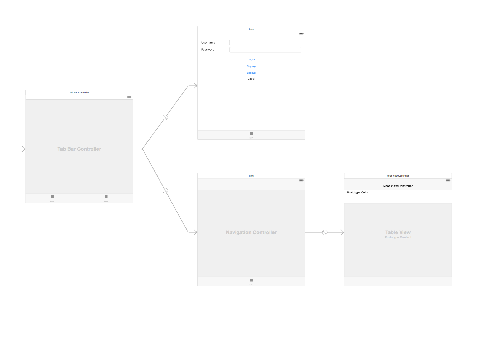
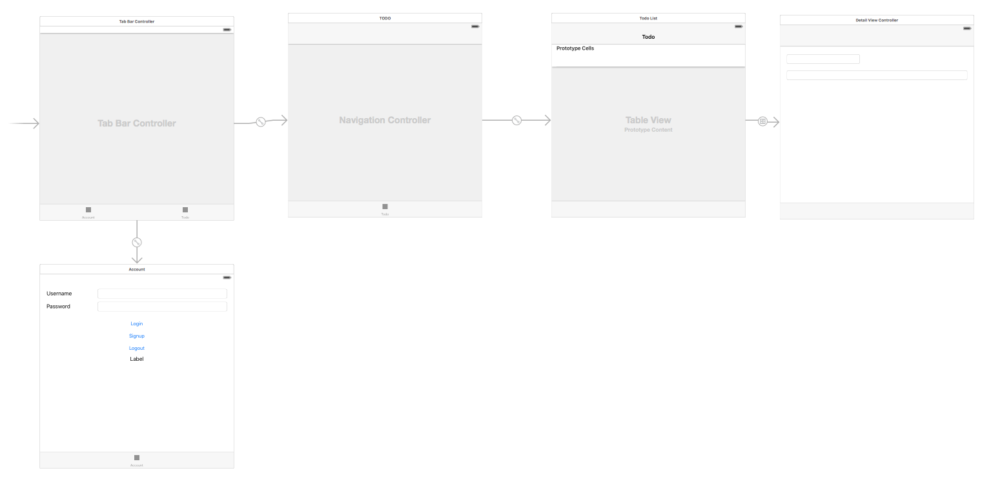

# Todo app guide

This document is a guide on how to buld a TODO list app

* Basic signup / login
* Add todo item
* Edit the item
* Sync items across devices

## Sample code

It is easier to follow if we break down into mini steps, you can download the zip file for each step:

- Step0: Initial Scaffolded project [Download zip](https://github.com/skygear-demo/swift-meetup-todo-app/archive/step0.zip)
- Step1: Basic UI and show todo items in list [Download zip](https://github.com/skygear-demo/swift-meetup-todo-app/archive/step1.zip)
- Step2: Add Edit and "+" Button [Download zip](https://github.com/skygear-demo/swift-meetup-todo-app/archive/step2.zip)
- Step3: Save todo items to the cloud [Download zip](https://github.com/skygear-demo/swift-meetup-todo-app/archive/step3.zip)
- Step4: Add th detail UI, we can edit items now.[Download zip](https://github.com/skygear-demo/swift-meetup-todo-app/archive/step4.zip)
- Step5: Final Project! With item sync without refresh. [Download zip](https://github.com/skygear-demo/swift-meetup-todo-app/archive/step5.zip)


## Get the Server: Signup at portal.skygear.io
1. [Sign up](https://portal.skygear.io/signup) for the Skygear backend
2. Get Endpoint and API Key, you will need them to connect your app to the server

## Scarffolding the app
Open terminal and paste the following script:

`pod lib create --silent --template-url=https://github.com/SkygearIO/skygear-Scaffolding-iOS.git "SkygearTodoList"`

- Answer the questions in Terminal
- After running the script, you will get a scarffolding app with signup and login feature.

If you can't run the above script, you can also dowload the scarffolded project zip here: [Download Project zip of Step 0](https://github.com/skygear-demo/swift-meetup-todo-app/archive/step0.zip)


## Signup and Login 

Let's test the user authentication feature.

If you downloaded the zip directly, you'll need to fill in the app end point and API Key info in the `AppDelegate.swift`.


## Build Todo list UI

Then we will need to build the UI.

Drag the following things to the Story board:

* UITabViewController, and set it as the entry point
* Add the previous login view as one of the Tab Bar Items to the Tab view.
* Add a NavigationController, as one of the Tab Bar Items to the Tab view.
* A UITableViewController is automatically added, as the default root view controller of the Navigation Controller

The Storyboard now should look like this:



You can download the sample and see the how the project should look like here: [Download Project zip of Step 1](https://github.com/skygear-demo/swift-meetup-todo-app/archive/step1.zip)


## Show the existing todo items in the tableview

We will use a table view to show the todo items. Create a UITableViewController Class and name it `TodoTableViewController`.

There are a few functions in `TodoTableViewController` we need to implement:

`func numberOfSectionsInTableView(tableView: UITableView) -> Int`

`func tableView(tableView: UITableView, numberOfRowsInSection section: Int) -> Int`

`func tableView(tableView: UITableView, cellForRowAtIndexPath indexPath: NSIndexPath) -> UITableViewCell`

The implementation is already included in the Step 1: [Download Project zip of Step 1](https://github.com/skygear-demo/swift-meetup-todo-app/archive/step1.zip)


## Add items via the add button

We now wish to add 2 buttons: 
1. Edit button, to edit or delete an item
2. + button, to add button

Uncomment the Edit button to show the button.

```
// Uncomment the following line to display an Edit button in the navigation bar for this view controller.
// self.navigationItem.rightBarButtonItem = self.editButtonItem()
```

Note that we wish the edit button on top left, so let's update the code: 
`self.navigationItem.leftBarButtonItem = self.editButtonItem()`


Add a "Add" button

```
let addButton = UIBarButtonItem(barButtonSystemItem: .Add, target: self, action: #selector(insertNewObject(_:)))
        self.navigationItem.rightBarButtonItem = addButton
```
We now can see the buttons appear on the todo list page: [Download Project zip of Step 2](https://github.com/skygear-demo/swift-meetup-todo-app/archive/step2.zip)


## Save to cloud when user insert a new item

To save the record, we will implement the `insertNewObject()`

We will save the item as a `SKYRecord(recordType: "todo")`, and set it's value for each key we wish to save. 

```
    func insertNewObject(sender: AnyObject) {
        let alertController = UIAlertController(title: "Add To-Do item", message: nil, preferredStyle: .Alert)
        alertController.addAction(UIAlertAction(title: "Cancel", style: .Cancel, handler: nil))
        alertController.addAction(UIAlertAction(title: "Confirm", style: .Default, handler: { (action) in
            let title = alertController.textFields![0].text
            let todo = SKYRecord(recordType: "todo")
            todo.setObject(title!, forKey: "title")
            todo.setObject(SKYSequence(), forKey: "order")
            todo.setObject(false, forKey: "done")
            
            self.privateDB.saveRecord(todo, completion: { (record, error) in
                if (error != nil) {
                    print("error saving todo: \(error)")
                    return
                }
                
                self.objects.insert(todo, atIndex: 0)
                let indexPath = NSIndexPath(forRow: 0, inSection: 0)
                self.tableView.insertRowsAtIndexPaths([indexPath], withRowAnimation: .Automatic)
            })
        }))
        alertController.addTextFieldWithConfigurationHandler { (textField) in
            textField.placeholder = "Title"
        }
        self.presentViewController(alertController, animated: true, completion: nil)
    }

```

Now we can save the items to the cloud, even you log onto another device.
[Download Project zip of Step 3](https://github.com/skygear-demo/swift-meetup-todo-app/archive/step3.zip)


## Delete Items

As we query `todo` items on the criteria `done==false`, so if we want to delete the item, we can just mark `done` as `true`.

Then we need to delete the item in the tableview.


```
 override func tableView(tableView: UITableView, canEditRowAtIndexPath indexPath: NSIndexPath) -> Bool {
        // Return false if you do not want the specified item to be editable.
        return true
    }

    override func tableView(tableView: UITableView, commitEditingStyle editingStyle: UITableViewCellEditingStyle, forRowAtIndexPath indexPath: NSIndexPath) {
        if editingStyle == .Delete {
            let todo = objects[indexPath.row] as! SKYRecord
            todo.setObject(true, forKey: "done")
            self.privateDB.saveRecord(todo, completion: { (record, error) in
                if (error != nil) {
                    print("error saving todo: \(error)")
                    return
                }
                
                self.objects.removeAtIndex(indexPath.row) as! SKYRecord
                tableView.deleteRowsAtIndexPaths([indexPath], withRowAnimation: .Fade)
            })
        } else if editingStyle == .Insert {
            // Create a new instance of the appropriate class, insert it into the array, and add a new row to the table view.
        } else {
            print("Editing \(editingStyle)")
        }
    }
```

## Edit items

Add a View Controller to the Storyboard, and create a `DetailViewController` class.

We will add a view controller in the storyboard.



We only need two simple text fields in this view.

Connect the segue from the cell in the `TodoTableViewController`, choose the `show` option. When user taps the cell, it will show the detail view.

In `DetailViewController.swift`, we will need to do 2 following things:

1. Fill in the data
2. Listen for field change and save the record.


We now can edit the items in the detail view and mark the item as deleted. You can download the sample project here: [Download Project zip of Step 4](https://github.com/skygear-demo/swift-meetup-todo-app/archive/step4.zip)


## Sync the todo list with query subscription

We then will implement the data sync with Skygear query change subscription. It doesn't involve much code.

The steps are:

1. Register the device for push notification
2. Define the query change subscription and add the listener
3. Add code to handle the changes

Register in application delegate

```
func application(application: UIApplication, didFinishLaunchingWithOptions launchOptions: [NSObject: AnyObject]?) -> Bool {
    some code…
    
    // This will prompt the user for permission to send remote notification
    application.registerUserNotificationSettings(UIUserNotificationSettings())
    application.registerForRemoteNotifications()
    
    return true
}
    ```


```
func application(application: UIApplication, didRegisterForRemoteNotificationsWithDeviceToken deviceToken: NSData) {
    print("Registered for Push notifications with token: \(deviceToken)");
}
```

```
SKYContainer.defaultContainer().registerDeviceCompletionHandler { (deviceID, error) in
        if error != nil {
            print("Failed to register device: \(error)")
            return
        }
        
        // You should put subscription creation logic in the following method
        // self.addSubscription(deviceID)
    }
```

Update action

```
func application(application: UIApplication, didFinishLaunchingWithOptions launchOptions: [NSObject: AnyObject]?) -> Bool {
    some code…
    
    SKYContainer.defaultContainer().delegate = self
    
    some code..
}
```

We need to set the AppDelegate to implement `SKYContainerDelegate`

And we need to implement `didReceiveNotification` in `AppDelegate` 

```
func container(container: SKYContainer!, didReceiveNotification notification: SKYNotification!) {
    print("received notification = \(notification)");
    NSNotificationCenter.defaultCenter().postNotificationName(ReceivedNotificationFromSkygaer, object: notification)
}
```

Add query subscription

```
func addSubscription(deviceID: String) {
    let query = SKYQuery(recordType: "todo", predicate: nil)
    let subscription = SKYSubscription(query: query, subscriptionID: "my todos")
    
    let operation = SKYModifySubscriptionsOperation(deviceID: deviceID, subscriptionsToSave: [subscription])
    operation.deviceID = deviceID
    operation.modifySubscriptionsCompletionBlock = { (savedSubscriptions, operationError) in
        dispatch_async(dispatch_get_main_queue()) {
            if operationError != nil {
                print(operationError)
            }
        }
    };
    SKYContainer.defaultContainer().privateCloudDatabase.executeOperation(operation)
}
```

In `TodoTableViewController`, let's tell the table iew controller to update the data when there is remote notifications. We do this in `viewDidLoad`.

```
override func viewDidLoad() {
    some code...
    
    NSNotificationCenter.defaultCenter().addObserverForName(ReceivedNotificationFromSkygaer, object: nil, queue: NSOperationQueue.mainQueue()) { (notification) in
        self.updateData()
    }
    
    some code...
}
```

You will be able to see the sync result in the demo project:
[Download Project zip of Step 5](https://github.com/skygear-demo/swift-meetup-todo-app/archive/step5.zip)


## Done!
We now have a full-featured todo list app:

* Basic signup / login
* Add todo item
* Edit the item
* Sync items across devices


You can download the complete project here: [Download Project zip of Step 5](https://github.com/skygear-demo/swift-meetup-todo-app/archive/step5.zip)


